# [📈 Live Status](https://status.fashionunited.com): <!--live status--> **🟩 All systems operational**

This repository contains the open-source uptime monitor and status page for [FashionUnited](https://fashionunited.info), powered by [Upptime](https://github.com/upptime/upptime).

With [Upptime](https://upptime.js.org), you can get your own unlimited and free uptime monitor and status page, powered entirely by a GitHub repository. We use [Issues](https://github.com/fuww/status.fashionunited.com/issues) as incident reports, [Actions](https://github.com/fuww/status.fashionunited.com/actions) as uptime monitors, and [Pages](https://status.fashionunited.com) for the status page.

<!--start: status pages-->
<!-- This summary is generated by Upptime (https://github.com/upptime/upptime) -->
<!-- Do not edit this manually, your changes will be overwritten -->
<!-- prettier-ignore -->
| URL | Status | History | Response Time | Uptime |
| --- | ------ | ------- | ------------- | ------ |
|  [fashionunited.at](https://fashionunited.at) | 🟩 Up | [fashionunited-at.yml](https://github.com/fuww/status/commits/HEAD/history/fashionunited-at.yml) | 

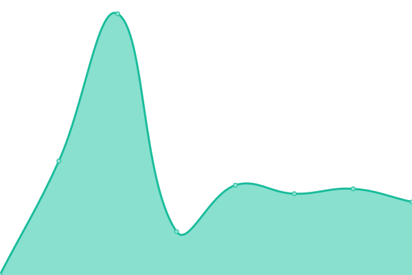 303ms
     
 | 

<a href="https://status.fashionunited.com/history/fashionunited-at">100.00%</a>
    

|  [fashionunited.be](https://fashionunited.be) | 🟩 Up | [fashionunited-be.yml](https://github.com/fuww/status/commits/HEAD/history/fashionunited-be.yml) | 

 325ms
     
 | 

<a href="https://status.fashionunited.com/history/fashionunited-be">100.00%</a>
    

|  [fashionunited.ca](https://fashionunited.ca) | 🟩 Up | [fashionunited-ca.yml](https://github.com/fuww/status/commits/HEAD/history/fashionunited-ca.yml) | 

 257ms
     
 | 

<a href="https://status.fashionunited.com/history/fashionunited-ca">0.00%</a>
    

|  [fashionunited.ch](https://fashionunited.ch) | 🟩 Up | [fashionunited-ch.yml](https://github.com/fuww/status/commits/HEAD/history/fashionunited-ch.yml) | 

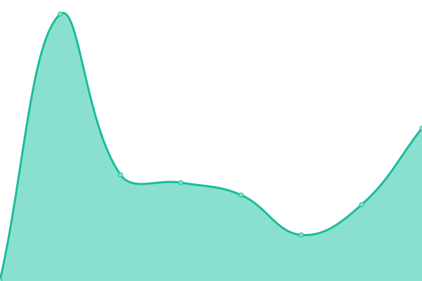 361ms
     
 | 

<a href="https://status.fashionunited.com/history/fashionunited-ch">100.00%</a>
    

|  [fashionunited.cl](https://fashionunited.cl) | 🟩 Up | [fashionunited-cl.yml](https://github.com/fuww/status/commits/HEAD/history/fashionunited-cl.yml) | 

 266ms
     
 | 

<a href="https://status.fashionunited.com/history/fashionunited-cl">100.00%</a>
    

|  [fashionunited.co](https://fashionunited.co) | 🟩 Up | [fashionunited-co.yml](https://github.com/fuww/status/commits/HEAD/history/fashionunited-co.yml) | 

 213ms
     
 | 

<a href="https://status.fashionunited.com/history/fashionunited-co">100.00%</a>
    

|  [fashionunited.co.nz](https://fashionunited.co.nz) | 🟩 Up | [fashionunited-co-nz.yml](https://github.com/fuww/status/commits/HEAD/history/fashionunited-co-nz.yml) | 

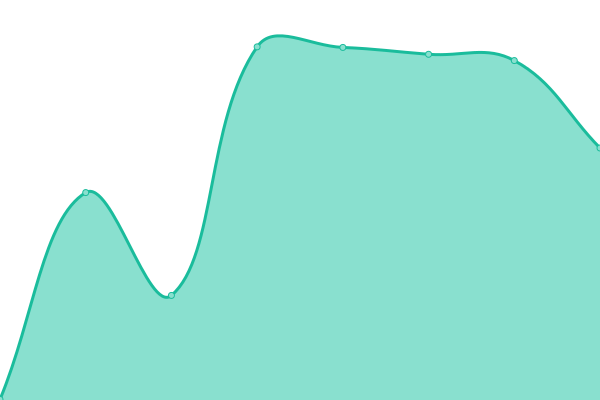 585ms
     
 | 

<a href="https://status.fashionunited.com/history/fashionunited-co-nz">100.00%</a>
    

|  [fashionunited.co.uk](https://fashionunited.co.uk) | 🟩 Up | [fashionunited-co-uk.yml](https://github.com/fuww/status/commits/HEAD/history/fashionunited-co-uk.yml) | 

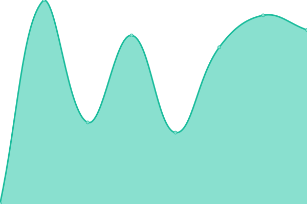 585ms
     
 | 

<a href="https://status.fashionunited.com/history/fashionunited-co-uk">100.00%</a>
    

|  [cn.fashionunited.com](https://cn.fashionunited.com) | 🟩 Up | [cn-fashionunited-com.yml](https://github.com/fuww/status/commits/HEAD/history/cn-fashionunited-com.yml) | 

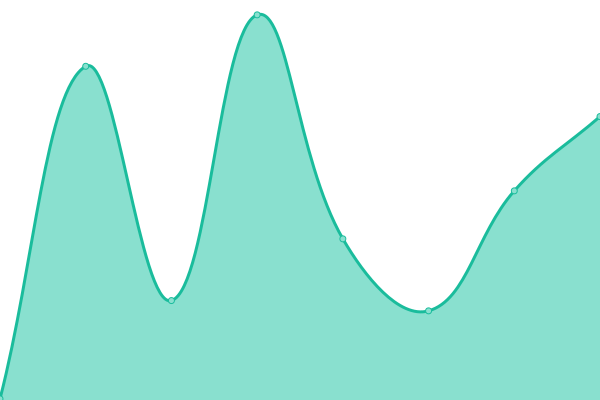 312ms
     
 | 

<a href="https://status.fashionunited.com/history/cn-fashionunited-com">100.00%</a>
    

|  [ru.fashionunited.com](https://ru.fashionunited.com) | 🟩 Up | [ru-fashionunited-com.yml](https://github.com/fuww/status/commits/HEAD/history/ru-fashionunited-com.yml) | 

 282ms
     
 | 

<a href="https://status.fashionunited.com/history/ru-fashionunited-com">100.00%</a>
    

|  [fashionunited.com](https://fashionunited.com) | 🟩 Up | [fashionunited-com.yml](https://github.com/fuww/status/commits/HEAD/history/fashionunited-com.yml) | 

 257ms
     
 | 

<a href="https://status.fashionunited.com/history/fashionunited-com">100.00%</a>
    

|  [fashionunited.com.ar](https://fashionunited.com.ar) | 🟩 Up | [fashionunited-com-ar.yml](https://github.com/fuww/status/commits/HEAD/history/fashionunited-com-ar.yml) | 

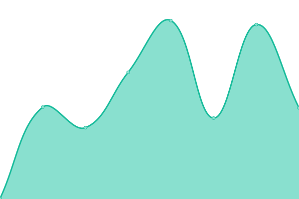 838ms
     
 | 

<a href="https://status.fashionunited.com/history/fashionunited-com-ar">100.00%</a>
    

|  [fashionunited.com.br](https://fashionunited.com.br) | 🟩 Up | [fashionunited-com-br.yml](https://github.com/fuww/status/commits/HEAD/history/fashionunited-com-br.yml) | 

 357ms
     
 | 

<a href="https://status.fashionunited.com/history/fashionunited-com-br">100.00%</a>
    

|  [fashionunited.com.pe](https://fashionunited.com.pe) | 🟩 Up | [fashionunited-com-pe.yml](https://github.com/fuww/status/commits/HEAD/history/fashionunited-com-pe.yml) | 

 324ms
     
 | 

<a href="https://status.fashionunited.com/history/fashionunited-com-pe">100.00%</a>
    

|  [fashionunited.com.tr](https://fashionunited.com.tr) | 🟩 Up | [fashionunited-com-tr.yml](https://github.com/fuww/status/commits/HEAD/history/fashionunited-com-tr.yml) | 

 366ms
     
 | 

<a href="https://status.fashionunited.com/history/fashionunited-com-tr">100.00%</a>
    

|  [fashionunited.cz](https://fashionunited.cz) | 🟩 Up | [fashionunited-cz.yml](https://github.com/fuww/status/commits/HEAD/history/fashionunited-cz.yml) | 

 314ms
     
 | 

<a href="https://status.fashionunited.com/history/fashionunited-cz">100.00%</a>
    

|  [fashionunited.de](https://fashionunited.de) | 🟩 Up | [fashionunited-de.yml](https://github.com/fuww/status/commits/HEAD/history/fashionunited-de.yml) | 

 312ms
     
 | 

<a href="https://status.fashionunited.com/history/fashionunited-de">100.00%</a>
    

|  [fashionunited.dk](https://fashionunited.dk) | 🟩 Up | [fashionunited-dk.yml](https://github.com/fuww/status/commits/HEAD/history/fashionunited-dk.yml) | 

 370ms
     
 | 

<a href="https://status.fashionunited.com/history/fashionunited-dk">100.00%</a>
    

|  [fashionunited.es](https://fashionunited.es) | 🟩 Up | [fashionunited-es.yml](https://github.com/fuww/status/commits/HEAD/history/fashionunited-es.yml) | 

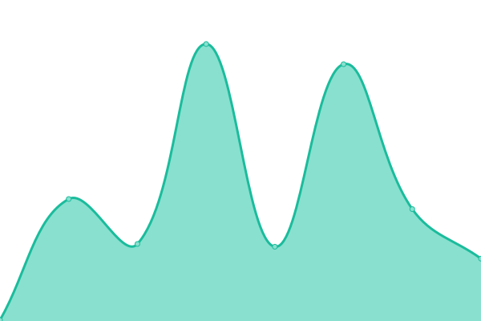 268ms
     
 | 

<a href="https://status.fashionunited.com/history/fashionunited-es">100.00%</a>
    

|  [fashionunited.fi](https://fashionunited.fi) | 🟩 Up | [fashionunited-fi.yml](https://github.com/fuww/status/commits/HEAD/history/fashionunited-fi.yml) | 

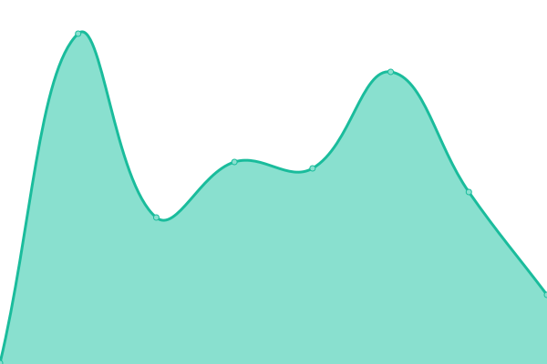 264ms
     
 | 

<a href="https://status.fashionunited.com/history/fashionunited-fi">100.00%</a>
    

|  [fashionunited.fr](https://fashionunited.fr) | 🟩 Up | [fashionunited-fr.yml](https://github.com/fuww/status/commits/HEAD/history/fashionunited-fr.yml) | 

 265ms
     
 | 

<a href="https://status.fashionunited.com/history/fashionunited-fr">100.00%</a>
    

|  [fashionunited.hk](https://fashionunited.hk) | 🟩 Up | [fashionunited-hk.yml](https://github.com/fuww/status/commits/HEAD/history/fashionunited-hk.yml) | 

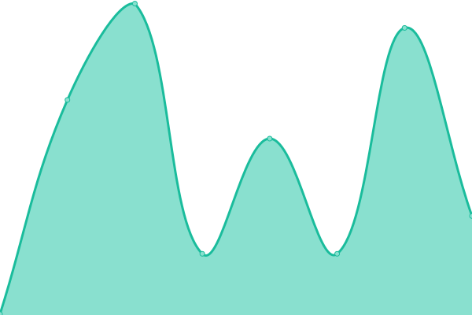 261ms
     
 | 

<a href="https://status.fashionunited.com/history/fashionunited-hk">100.00%</a>
    

|  [fashionunited.hu](https://fashionunited.hu) | 🟩 Up | [fashionunited-hu.yml](https://github.com/fuww/status/commits/HEAD/history/fashionunited-hu.yml) | 

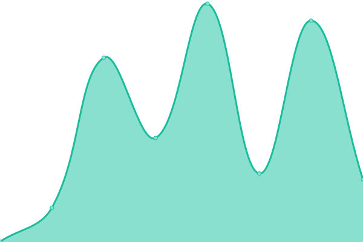 324ms
     
 | 

<a href="https://status.fashionunited.com/history/fashionunited-hu">100.00%</a>
    

|  [fashionunited.ie](https://fashionunited.ie) | 🟩 Up | [fashionunited-ie.yml](https://github.com/fuww/status/commits/HEAD/history/fashionunited-ie.yml) | 

 433ms
     
 | 

<a href="https://status.fashionunited.com/history/fashionunited-ie">100.00%</a>
    

|  [fashionunited.in](https://fashionUnited.in) | 🟩 Up | [fashionunited-in.yml](https://github.com/fuww/status/commits/HEAD/history/fashionunited-in.yml) | 

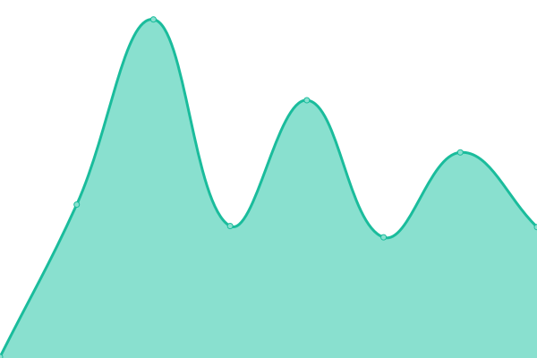 235ms
     
 | 

<a href="https://status.fashionunited.com/history/fashionunited-in">100.00%</a>
    

|  [fashionunited.info](https://fashionunited.info) | 🟩 Up | [fashionunited-info.yml](https://github.com/fuww/status/commits/HEAD/history/fashionunited-info.yml) | 

 292ms
     
 | 

<a href="https://status.fashionunited.com/history/fashionunited-info">100.00%</a>
    

|  [fashionunited.it](https://fashionunited.it) | 🟩 Up | [fashionunited-it.yml](https://github.com/fuww/status/commits/HEAD/history/fashionunited-it.yml) | 

 351ms
     
 | 

<a href="https://status.fashionunited.com/history/fashionunited-it">100.00%</a>
    

|  [fashionunited.jp](https://fashionunited.jp) | 🟩 Up | [fashionunited-jp.yml](https://github.com/fuww/status/commits/HEAD/history/fashionunited-jp.yml) | 

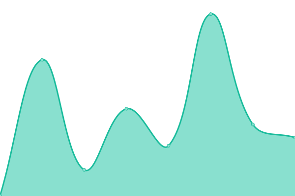 313ms
     
 | 

<a href="https://status.fashionunited.com/history/fashionunited-jp">100.00%</a>
    

|  [fashionunited.lu](https://fashionunited.lu) | 🟩 Up | [fashionunited-lu.yml](https://github.com/fuww/status/commits/HEAD/history/fashionunited-lu.yml) | 

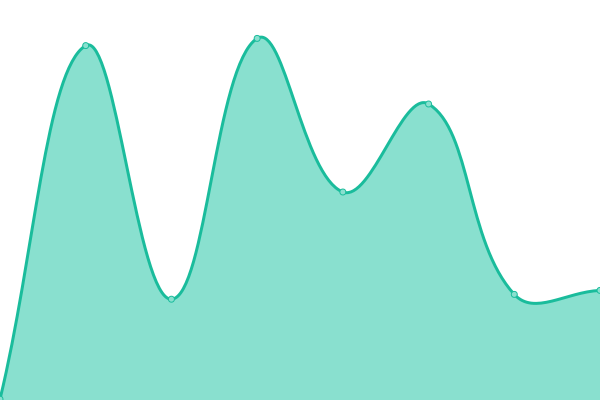 342ms
     
 | 

<a href="https://status.fashionunited.com/history/fashionunited-lu">100.00%</a>
    

|  [fashionunited.mx](https://fashionunited.mx) | 🟩 Up | [fashionunited-mx.yml](https://github.com/fuww/status/commits/HEAD/history/fashionunited-mx.yml) | 

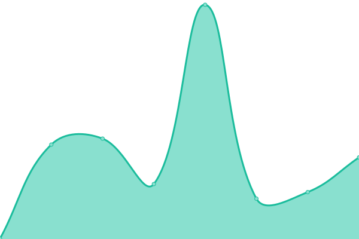 254ms
     
 | 

<a href="https://status.fashionunited.com/history/fashionunited-mx">100.00%</a>
    

|  [fashionunited.nl](https://fashionunited.nl) | 🟩 Up | [fashionunited-nl.yml](https://github.com/fuww/status/commits/HEAD/history/fashionunited-nl.yml) | 

 232ms
     
 | 

<a href="https://status.fashionunited.com/history/fashionunited-nl">100.00%</a>
    

|  [fashionunited.no](https://fashionunited.no) | 🟩 Up | [fashionunited-no.yml](https://github.com/fuww/status/commits/HEAD/history/fashionunited-no.yml) | 

 297ms
     
 | 

<a href="https://status.fashionunited.com/history/fashionunited-no">100.00%</a>
    

|  [fashionunited.nz](https://fashionunited.nz) | 🟩 Up | [fashionunited-nz.yml](https://github.com/fuww/status/commits/HEAD/history/fashionunited-nz.yml) | 

 112ms
     
 | 

<a href="https://status.fashionunited.com/history/fashionunited-nz">100.00%</a>
    

|  [fashionunited.pl](https://fashionunited.pl) | 🟩 Up | [fashionunited-pl.yml](https://github.com/fuww/status/commits/HEAD/history/fashionunited-pl.yml) | 

 291ms
     
 | 

<a href="https://status.fashionunited.com/history/fashionunited-pl">100.00%</a>
    

|  [fashionunited.pt](https://fashionunited.pt) | 🟩 Up | [fashionunited-pt.yml](https://github.com/fuww/status/commits/HEAD/history/fashionunited-pt.yml) | 

 232ms
     
 | 

<a href="https://status.fashionunited.com/history/fashionunited-pt">100.00%</a>
    

|  [fashionunited.se](https://fashionunited.se) | 🟩 Up | [fashionunited-se.yml](https://github.com/fuww/status/commits/HEAD/history/fashionunited-se.yml) | 

 328ms
     
 | 

<a href="https://status.fashionunited.com/history/fashionunited-se">100.00%</a>
    

|  [fashionunited.tv](https://fashionunited.tv) | 🟩 Up | [fashionunited-tv.yml](https://github.com/fuww/status/commits/HEAD/history/fashionunited-tv.yml) | 

 338ms
     
 | 

<a href="https://status.fashionunited.com/history/fashionunited-tv">100.00%</a>
    

|  [fashionunited.uk](https://fashionunited.uk) | 🟩 Up | [fashionunited-uk.yml](https://github.com/fuww/status/commits/HEAD/history/fashionunited-uk.yml) | 

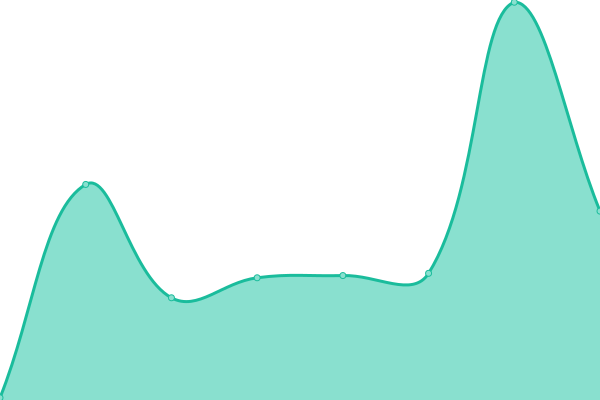 87ms
     
 | 

<a href="https://status.fashionunited.com/history/fashionunited-uk">100.00%</a>
    

|  [Google](https://www.google.com) | 🟩 Up | [google.yml](https://github.com/fuww/status/commits/HEAD/history/google.yml) | 

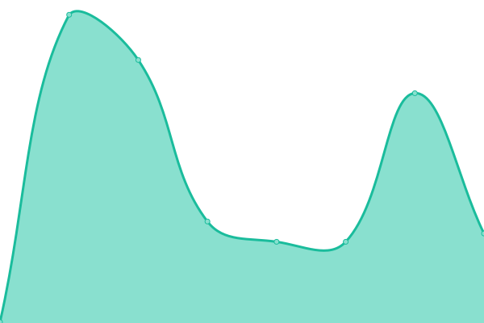 123ms
     
 | 

<a href="https://status.fashionunited.com/history/google">100.00%</a>
    

|  [Wikipedia](https://en.wikipedia.org) | 🟩 Up | [wikipedia.yml](https://github.com/fuww/status/commits/HEAD/history/wikipedia.yml) | 

 186ms
     
 | 

<a href="https://status.fashionunited.com/history/wikipedia">100.00%</a>
    

|  [Hacker News](https://news.ycombinator.com) | 🟩 Up | [hacker-news.yml](https://github.com/fuww/status/commits/HEAD/history/hacker-news.yml) | 

 348ms
     
 | 

<a href="https://status.fashionunited.com/history/hacker-news">99.73%</a>
    

<!--end: status pages-->

[**Visit our status website →**](https://status.fashionunited.com)

## 📄 License

- Powered by: [Upptime](https://github.com/upptime/upptime)
- Code: [MIT](./LICENSE) © [FashionUnited](https://fashionunited.info)
- Data in the `./history` directory: [Open Database License](https://opendatacommons.org/licenses/odbl/1-0/)
